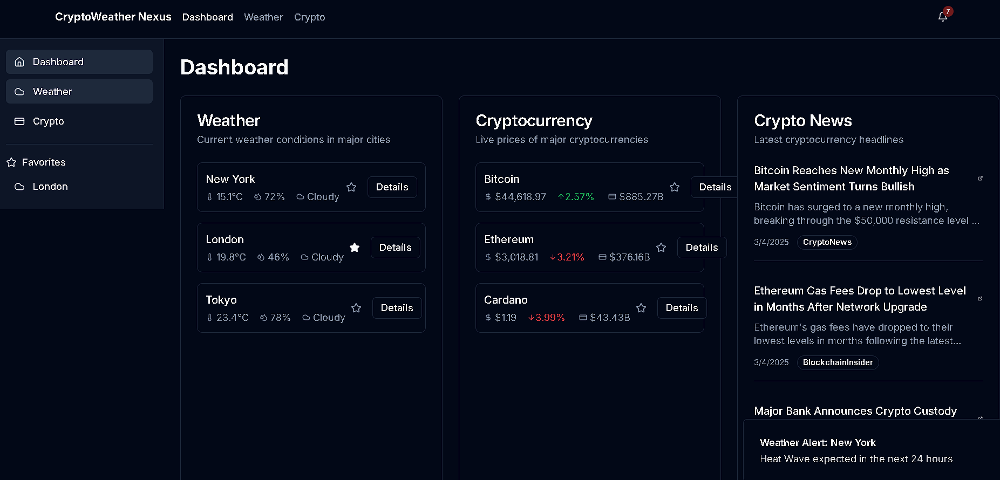

# CryptoWeatherNexus 

**A Unified Dashboard for Cryptocurrency Trends and Real-Time Weather Analytics**

## Table of Contents
- [Features](#features)
- [Getting Started](#getting-started)
- [Installation](#installation)
- [Running the App](#running-the-app)
- [Build](#build)
- [Deployment](#deployment)
- [Documentation](#documentation)
- [Challenges & Resolutions](#challenges--resolutions)
- [Alternative APIs](#alternative-apis)
- [Tech Stack](#tech-stack)

## Features
- **Unified Dashboard**: Simultaneous view of crypto markets and weather conditions
- **Real-Time Data**:
  - Cryptocurrency prices (Bitcoin, Ethereum, Cardano)
  - Weather metrics for major cities (New York, London, Tokyo)
- **News Integration**: Latest crypto headlines from trusted sources
- **Responsive Design**: Optimized for mobile and desktop

## Getting Started

### Prerequisites
- Node.js ≥18.x
- npm ≥9.x
- API Keys:
  - OpenWeatherMap API (Weather)
  - CoinGecko API (Crypto)
  - NewsAPI (Optional)

## Installation

**Clone repository**
git clone https://github.com/rkd-2004/CryptoWeatherNexus.git

cd CryptoWeatherNexus

**Install dependencies**
npm install

**Configure environment**
cp .env.example .env.local

**Add your API keys to .env.local**

**Running the App**

npm run dev

Visit http://localhost:3000

**Build**
npm run build

# Deployment
Deployed via Vercel:
https://crypto-weather-nexus-project.vercel.app

# Documentation
## Design Decisions

**Component Architecture:**
Modular components for easy maintenance (/components/crypto, /components/weather)

State management via Redux Toolkit

**Styling:**

Tailwind CSS for utility-first styling

Radix UI primitives for accessible components

**Data Fetching:**

SWR for stale-while-revalidate caching

WebSocket integration for real-time crypto prices

# Challenges & Resolutions
**Challenge	Resolution**

Dependency conflicts (React 19 ↔ date-fns)	Upgraded to react-day-picker@9.x + legacy-peer-deps

UI button inconsistencies	Standardized with Tailwind @apply directives

Module resolution errors

API rate limiting	Implemented client-side caching with localStorage

Notification button updates dropdown menu inconsistencies.

### Alternative APIs
**Feature	Primary API	Alternatives**
Weather	OpenWeatherMap	WeatherAPI, Climacell

Crypto	CoinGecko	CoinCap, Binance API

News	NewsAPI	Cryptocompare, TheNewsAPI

# **Tech Stack**
Framework: Next.js 14

**Styling:** Tailwind CSS + CSS Modules

**UI Library**: Radix UI Primitives

**State Management**: Redux Toolkit

**Types**: TypeScript 5.3

**Deployment:** Vercel

